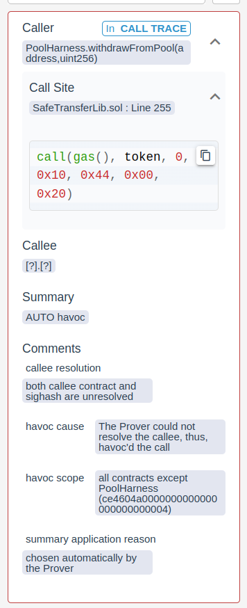

# Certora Question: Solady SafeTransferLib

## Summary
I am currently verifying a project that uses Solady's SafeTransferLib.
My specification includes a property that `currentContract` should hold zero balance when the function `IManager.finalize(address)` was called.

This repository contains an example project reproducing the issue.

The verification target is `Pool` contract.
[Pool.sol](src/Pool.sol) implements a function `withdrawFromPool(address, uint256)` that uses `token.safeTransfer(address, uint256)` to transfer the full amount out of the contract before `IManager.finalize(address)` is called.
Therefore the property should be pretty straight forward to implement.

However, it's not (for me).
The balances of any token will be havoc'd.
This happens when the `call` instruction in SafeTransferLib's [line 255](https://github.com/Vectorized/solady/blob/main/src/utils/SafeTransferLib.sol#L255) is reached.
The prover cannot resolve the callee and therefore havoc's the call.

The relevant implementation of `safeTransfer(address, address, uint256)` can be found here:

https://github.com/Vectorized/solady/blob/7593af59974a1bb12ebe10d87b95693c293234ed/src/utils/SafeTransferLib.sol#L245-L263


The following screenshot from the report shows this:



All contracts but `Pool` are havoc'd, which includes `token`. If the contract were to use `IERC20(token).transfer(...)` instead this issue would not araise.

## Question

How can I prevent that `token.balanceOf(currentContract)` is havoc'd?

## Example
This repository contains an example project which showcases the issue.

I am using certora-cli version 6.1.4 and solc version 0.8.13.

### Report
https://prover.certora.com/output/36946/b64754f161c144f9888c53bc4da8866a?anonymousKey=8d7734f55831de6be41693ad5fb52b22093df8a7

### Install
I am using `virualenv` to install `solc-select` and `certora-cli` locally.

To recreate my setup do the following:
```bash
git clone git@github.com:0xpoolboy/certoraQuestion-solady-SafeTransfer.git && cd certoraQuestion-solady-SafeTransfer
forge install
virtualenv venv && source venv/bin/activate
pip -r pip install -r requirements.txt && source venv/bin/activate
solc-select install 0.8.13 && solc-select use 0.8.13
```

To reproduce the report run:
```bash
certora/confs/Pool.conf --rule balanceZeroWhenFinialized --method 'withdrawFromPool(address,uint256)'
```